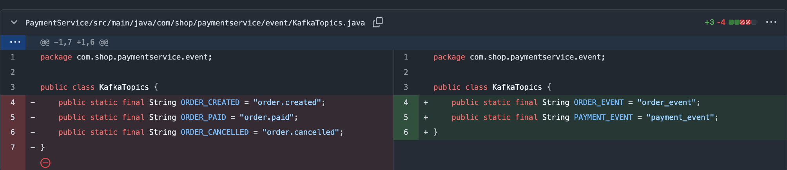
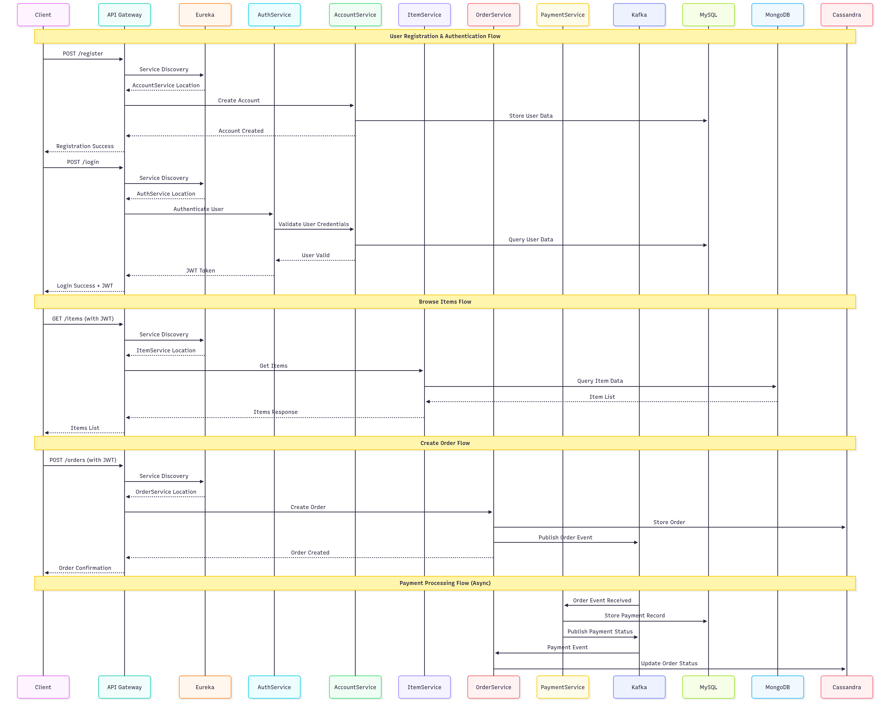

# Final Project Enhancement

## Please address comments in final project demo sessions.

### Document defects of your design and how would you improve.

#### 1. Inventory & Oversell (Simultaneous Orders)

**Current Issue**

* If `ItemService` just does a *read stock → write new stock*, it can oversell when multiple users order at once.
* There’s no concept of *reservation* → users can pay for items that already sold out seconds earlier.
* Dual writes (e.g., update DB, then publish Kafka) can drift, creating phantom stock.

**Better Approach**

* Optimistic locking (version column).
* Pessimistic locking (SELECT … FOR UPDATE).

---

#### 2.Order workflow & consistency

**Current issues**

* Order submits, then async payment: user waits; if the payment topic/back end lags, UX is slow and state is unclear.
* No clear **Saga** coordination → partial updates possible.
* No **idempotent** `submitPayment` (resends may double charge or double transition).

**Upgrade**

* Use a **Saga pattern**. Two options:
    * **Orchestrated**: OrderService is the orchestrator. Steps:
        1. `ReserveInventory` → 2\) `PreAuthorizePayment` → 3\) `CommitInventory` & `CapturePayment` → 4\)
           `MarkOrderPaid`.  
           If any step fails, invoke compensating actions (`ReleaseInventory`, `VoidPayment`).
    * **Choreography**: services react to events (`OrderCreated` → Inventory reserves → Payment preauth, etc.). Start
      with orchestrator for clarity.

* **State machine** in orders: `CREATED → RESERVED → PAID → FULFILLING → SHIPPED → COMPLETED` (or `CANCELLED/EXPIRED`).
* **Idempotency \+ exactly-once semantics**
    * Make **every consumer idempotent** (store `eventId` processed).
    * **Payment submission**: require an `Idempotency-Key` (e.g., orderId) and store a de-dup record.

---

#### 3.Payment: async vs sync and “quick validity check”

**Current issues**

* Fully async payment slows feedback.

**Upgrade**: **Split payment into two phases**:

1. **Synchronous pre-authorization (instant “validity check”)**
    * `POST /payments/preauth {orderId, amount, paymentMethodId}`.  
      Return immediately with `APPROVED` or `DECLINED` (and a `preauthId`). This confirms the payment method is valid
      and funds are held.
2. **Asynchronous capture** after inventory is committed, or **synchronous capture** right after successful
   reservation (depends on risk appetite).
    * If capture is async, update UI immediately (“Payment authorized, order processing…”).
      **Fallback & resilience**

* Timeouts (\~2–3s) \+ **circuit breaker** around the payment provider.
* **Retry with backoff**, but never double-capture; use provider’s **idempotency keys**.
* If preauth fails → `RESERVATION_RELEASED`.

---

#### 4.API Gateway & auth

**Gaps**

* Gateway likely only forwards JWT; no fine-grained scopes/quotas. Potential thundering herd on downstream services.

**Improvements**

* Validate JWT at gateway and propagate claims via headers.
* Apply **rate limiting** and **client quotas** (e.g., per user/IP) especially on payment/reservation endpoints.
* **Zero-trust** between services (mTLS inside cluster or at least signed service tokens).

---

#### 5.Messaging, retries, and dead letters

**Gaps**

* No explicit DLQ strategy; no replay or poison-message handling.
  **Improvements**
* Configure Kafka topics with **DLQ** for each consumer group.
* Use **outbox** for producers; **retry (xN) → DLQ** for consumers.
* Build a small **DLQ replayer** admin endpoint.

---

### Fix code bugs, make all services runnable.

---

## Document your enhancements, along with necessary code snippets.

* Fixed kafka topic issue.
---

## Prepare architectural diagram of your final project. Including user flow & data flow.

### Architectural Diagram

---

### User Flows

#### 1. **User Registration Flow**

1. User visits the website and clicks "Register"
2. User fills out registration form with email, password, and profile information
3. Client sends registration request to API Gateway
4. API Gateway routes request to AccountService
5. AccountService validates user data and stores it in MySQL database
6. AccountService returns success response
7. User receives confirmation and is redirected to login page

#### 2. **User Authentication Flow**

1. User enters email and password on login page
2. Client sends login request to API Gateway
3. API Gateway routes request to AuthService
4. AuthService calls AccountService to validate user credentials
5. AccountService queries MySQL to verify user exists and password is correct
6. If valid, AuthService generates a JWT token
7. JWT token is returned to client and stored for subsequent requests

#### 3. **Product Browsing Flow**

1. User navigates to product catalog page
2. Client sends GET request to API Gateway with JWT token
3. API Gateway validates JWT token
4. API Gateway routes request to ItemService
5. ItemService queries MongoDB for product data and inventory
6. Product list is returned to client
7. User can view individual product details, filter, or search

#### 4. **Order Flow**

1. User adds items to cart (handled client-side)
2. User proceeds to checkout
3. Client sends order creation request to API Gateway with JWT token
4. API Gateway validates token and routes to OrderService
5. OrderService creates order record in Cassandra
6. OrderService publishes "order_created" event to Kafka
7. Order confirmation is returned to user immediately

#### 5. **Payment Processing Flow (Asynchronous)**

1. PaymentService listens to Kafka for order events
2. When order event is received, PaymentService processes payment
3. PaymentService stores payment record in MySQL
4. PaymentService publishes "payment_processed" event to Kafka
5. OrderService receives payment event and updates order status in Cassandra
6. User can check order status to see payment completion

#### 6. **Admin Product Management Flow**

1. Admin logs in with ROLE_ADMIN credentials
2. Admin navigates to product management interface
3. Admin creates/updates product information
4. Client sends POST/PATCH request to API Gateway with admin JWT
5. API Gateway validates admin role
6. API Gateway routes to ItemService
7. ItemService updates product data in MongoDB

---

### Data Flows

### **Synchronous Data Flows**

#### **Authentication Data Flow:**

- **Input**: User credentials (email, password)
- **Processing**: AuthService → AccountService → MySQL validation
- **Output**: JWT token for authenticated sessions

#### **Product Data Flow:**

- **Input**: Product search/filter criteria
- **Processing**: ItemService → MongoDB query
- **Output**: Product list with inventory information

#### **Order Creation Data Flow:**

- **Input**: Order details (items, quantities, shipping info)
- **Processing**: OrderService → Cassandra write
- **Output**: Order confirmation with order ID

---

### **Asynchronous Data Flows**

#### **Order-to-Payment Flow:**

1. **Event Trigger**: Order created in Cassandra
2. **Event Publishing**: OrderService publishes order event to Kafka
3. **Event Consumption**: PaymentService consumes order event
4. **Payment Processing**: PaymentService processes payment and stores in MySQL
5. **Status Update**: PaymentService publishes "payment_processed" event
6. **Order Update**: OrderService consumes payment event and updates order status

#### **Event-Driven Communication Pattern:**

- **Producer**: Services that create events (OrderService, PaymentService)
- **Message Broker**: Kafka handles event routing and delivery
- **Consumer**: Services that react to events (PaymentService, OrderService)
- **Benefits**: Decoupling, scalability, fault tolerance

---

### **Database-Specific Data Flows**

#### **MySQL Data Flow:**

- **User Management**: Account creation, profile updates, authentication
- **Payment Records**: Transaction history, payment status, billing information
- **Data Pattern**: ACID transactions, relational queries, user-specific data

#### **MongoDB Data Flow:**

- **Product Catalog**: Item metadata, descriptions, categories
- **Inventory Management**: Stock levels, availability, pricing
- **Data Pattern**: Document-based storage, flexible schema, product-centric queries

#### **Cassandra Data Flow:**

- **Order Storage**: Order creation, status tracking, order history
- **Data Pattern**: High write throughput, time-series data, distributed storage
- **Optimization**: Fast order creation and status updates

---

### **Service Discovery Data Flow**

1. **Service Registration**: Each microservice registers with Eureka on startup
2. **Health Monitoring**: Eureka continuously monitors service health
3. **Service Lookup**: API Gateway queries Eureka for service locations
4. **Load Balancing**: Eureka provides multiple instances for high availability
5. **Dynamic Routing**: API Gateway routes requests to healthy service instances

---

### **Security Data Flow**

1. **JWT Token Generation**: AuthService creates signed tokens with user claims
2. **Token Validation**: API Gateway validates JWT on each request
3. **Role-Based Access**: Services check user roles for authorization
4. **Secure Communication**: All inter-service communication uses HTTPS
5. **Session Management**: Stateless authentication using JWT tokens

